## Latest GitHub incident ❤️‍🩹

### {{ latest_incident_name }}

```
{{ latest_incident_details }}
```

## GitHub incident stats

<!-- Total incidents

Total incidents (Last year)

Total downtime (Last year)

SLA (Last year) -->




<!-- Most downed date (monday - sunday) -->

<!--  -->

## About this project

- Keep a [record](https://github.com/GitHub-Incident-History/GitHub-Incident-History/tree/main/incidents) of all GitHub incident history.
- [Fetch](https://github.com/GitHub-Incident-History/GitHub-Incident-History/actions/workflows/update_data.yml) new incidents data every hour automatically.
- [Create a commit](https://github.com/GitHub-Incident-History/GitHub-Incident-History/commits/github-incident-history) with corresponding [author date](https://docs.github.com/en/account-and-profile/setting-up-and-managing-your-github-profile/managing-contribution-settings-on-your-profile/troubleshooting-commits-on-your-timeline#how-github-uses-the-git-author-date-and-commit-date) for each incident, so it shows up as contributions under this account.
- Visualise GitHub incident history with your favourite [GitHub contribution visualisation tools](https://skyline.github.com/GitHub-Incident-History)!